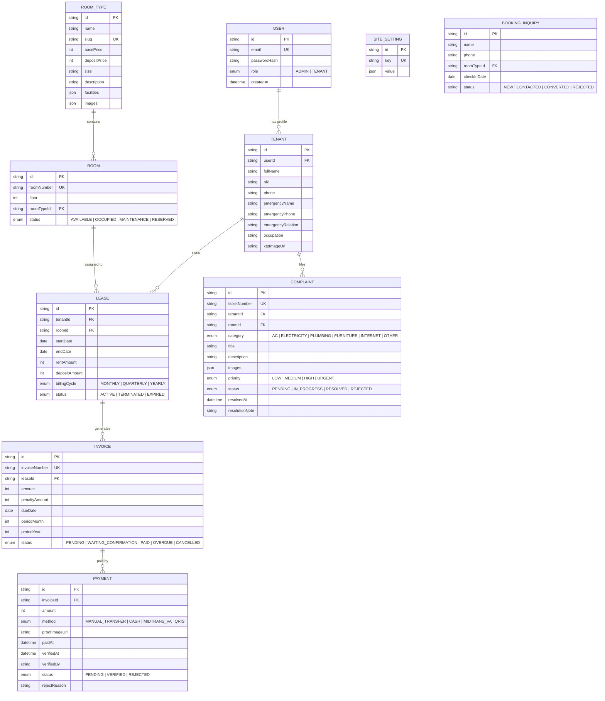

# Rencana Arsitektur & Implementasi Backend (PMS & Landing Page Kos)

Dokumen ini merupakan perencanaan teknis komprehensif untuk pengembangan backend sistem manajemen kos (**Kostara**). Rencana ini mencakup integrasi antara **Landing Page Publik**, **Admin Property Management System (PMS)**, dan **Tenant Portal (Portal Penghuni)**.

---

## 1. Analisis Kebutuhan & Integrasi Sistem Saat Ini

Berdasarkan struktur kode frontend yang telah di-clone, aplikasi terbagi menjadi 3 pilar:

| Pilar | Rute Frontend | Kebutuhan Data & Logika Backend |
| :--- | :--- | :--- |
| **Landing Page Publik** | `/`, `/kamar`, `/kamar/[slug]`, `/fasilitas`, `/kontak` | Katalog kamar dinamis, ketersediaan unit, form pertanyaan/booking awal (*lead capture*), pengaturan profil kos. |
| **Admin PMS** | `/admin/*` (Overview, Kamar, Penghuni, Tagihan, Komplain, Pengaturan) | CRUD Kamar & Unit, Manajemen Kontrak Penghuni, *Invoicing* otomatis & verifikasi pembayaran, eskalasi komplain perbaikan, kalkulasi analitik pendapatan. |
| **Tenant Portal** | `/portal/*` (Login, Dashboard, Tagihan, Komplain, Profil) | Autentikasi penghuni, melihat info kamar & tagihan aktif, upload bukti bayar, pengajuan tiket komplain fasilitas, riwayat kontrak. |

---

## 2. Arsitektur Terpisah (Frontend & Backend) & Tech Stack

Aplikasi sekarang dipisahkan menjadi 2 service mandiri:
- `frontend/`: Next.js 16 (App Router, Tailwind CSS v4, Lucide Icons, Recharts) pada port `3000`.
- `backend/`: Express.js + TypeScript + Prisma ORM pada port `5000`.

### Database Workflow (SQLite Lokal -> PostgreSQL Production)
1. **Fase Pengujian Lokal (Saat Ini)**:
   - Menggunakan **SQLite** (`file:./dev.db`) di dalam folder `backend/prisma/`.
   - Tidak memerlukan instalasi database server lokal, langsung siap diuji coba secara instan.
2. **Fase Migrasi ke PostgreSQL**:
   - Ganti `provider = "sqlite"` menjadi `provider = "postgresql"` di `backend/prisma/schema.prisma`.
   - Ubah `DATABASE_URL` di `backend/.env` menjadi connection string PostgreSQL (Supabase / Neon / Docker).
   - Jalankan `npx prisma migrate dev --name init_postgres` dan `npx prisma db seed`.

---

## 3. Entity-Relationship Diagram (ERD)



---

## 4. Skema Prisma Database (`prisma/schema.prisma`)

```prisma
datasource db {
  provider = "postgresql"
  url      = env("DATABASE_URL")
}

generator client {
  provider = "prisma-client-js"
}

enum Role {
  ADMIN
  TENANT
}

enum RoomStatus {
  AVAILABLE
  OCCUPIED
  MAINTENANCE
  RESERVED
}

enum LeaseStatus {
  ACTIVE
  TERMINATED
  EXPIRED
}

enum InvoiceStatus {
  PENDING
  WAITING_CONFIRMATION
  PAID
  OVERDUE
  CANCELLED
}

enum PaymentStatus {
  PENDING
  VERIFIED
  REJECTED
}

enum PaymentMethod {
  MANUAL_TRANSFER
  CASH
  MIDTRANS_VA
  QRIS
}

enum ComplaintCategory {
  AC
  ELECTRICITY
  PLUMBING
  FURNITURE
  INTERNET
  OTHER
}

enum ComplaintPriority {
  LOW
  MEDIUM
  HIGH
  URGENT
}

enum ComplaintStatus {
  PENDING
  IN_PROGRESS
  RESOLVED
  REJECTED
}

model User {
  id           String   @id @default(cuid())
  email        String   @unique
  passwordHash String
  name         String
  role         Role     @default(TENANT)
  avatarUrl    String?
  createdAt    DateTime @default(now())
  updatedAt    DateTime @updatedAt

  tenant       Tenant?
}

model RoomType {
  id           String   @id @default(cuid())
  name         String
  slug         String   @unique
  basePrice    Int
  depositPrice Int      @default(0)
  size         String
  description  String
  facilities   String[]
  images       String[]
  createdAt    DateTime @default(now())
  updatedAt    DateTime @updatedAt

  rooms        Room[]
  inquiries    BookingInquiry[]
}

model Room {
  id          String     @id @default(cuid())
  roomNumber  String     @unique
  floor       Int        @default(1)
  status      RoomStatus @default(AVAILABLE)
  notes       String?
  roomTypeId  String
  roomType    RoomType   @relation(fields: [roomTypeId], references: [id])
  createdAt   DateTime   @default(now())
  updatedAt   DateTime   @updatedAt

  leases      Lease[]
  complaints  Complaint[]
}

model Tenant {
  id                String      @id @default(cuid())
  userId            String?     @unique
  user              User?       @relation(fields: [userId], references: [id], onDelete: SetNull)
  fullName          String
  nik               String      @unique
  phone             String
  emergencyName     String?
  emergencyPhone    String?
  emergencyRelation String?
  occupation        String?
  ktpImageUrl       String?
  createdAt         DateTime    @default(now())
  updatedAt         DateTime    @updatedAt

  leases            Lease[]
  complaints        Complaint[]
}

model Lease {
  id            String      @id @default(cuid())
  tenantId      String
  tenant        Tenant      @relation(fields: [tenantId], references: [id])
  roomId        String
  room          Room        @relation(fields: [roomId], references: [id])
  startDate     DateTime
  endDate       DateTime
  rentAmount    Int
  depositAmount Int         @default(0)
  status        LeaseStatus @default(ACTIVE)
  createdAt     DateTime    @default(now())
  updatedAt     DateTime    @updatedAt

  invoices      Invoice[]
}

model Invoice {
  id            String        @id @default(cuid())
  invoiceNumber String        @unique
  leaseId       String
  lease         Lease         @relation(fields: [leaseId], references: [id])
  amount        Int
  penaltyAmount Int           @default(0)
  dueDate       DateTime
  periodMonth   Int
  periodYear    Int
  status        InvoiceStatus @default(PENDING)
  createdAt     DateTime      @default(now())
  updatedAt     DateTime      @updatedAt

  payments      Payment[]
}

model Payment {
  id            String        @id @default(cuid())
  invoiceId     String
  invoice       Invoice       @relation(fields: [invoiceId], references: [id])
  amount        Int
  method        PaymentMethod @default(MANUAL_TRANSFER)
  proofImageUrl String?
  paidAt        DateTime      @default(now())
  verifiedAt    DateTime?
  verifiedBy    String?
  status        PaymentStatus @default(PENDING)
  rejectReason  String?
  createdAt     DateTime      @default(now())
  updatedAt     DateTime      @updatedAt
}

model Complaint {
  id             String            @id @default(cuid())
  ticketNumber   String            @unique
  tenantId       String
  tenant         Tenant            @relation(fields: [tenantId], references: [id])
  roomId         String
  room           Room              @relation(fields: [roomId], references: [id])
  category       ComplaintCategory
  title          String
  description    String
  images         String[]
  priority       ComplaintPriority @default(MEDIUM)
  status         ComplaintStatus   @default(PENDING)
  resolvedAt     DateTime?
  resolutionNote String?
  createdAt      DateTime          @default(now())
  updatedAt      DateTime          @updatedAt
}

model SiteSetting {
  id        String   @id @default(cuid())
  key       String   @unique
  value     Json
  updatedAt DateTime @updatedAt
}

model BookingInquiry {
  id          String   @id @default(cuid())
  name        String
  phone       String
  roomTypeId  String?
  roomType    RoomType? @relation(fields: [roomTypeId], references: [id])
  checkInDate DateTime?
  notes       String?
  status      String   @default("NEW")
  createdAt   DateTime @default(now())
}
```

---

## 5. Rute API Backend (Endpoints Matrix)

### A. Autentikasi (`/api/auth/*`)
- `POST /api/auth/[...nextauth]` — Handler Auth.js (Login, session, token verification).
- `POST /api/auth/register-tenant` *(Admin only)* — Membuat akun portal untuk penghuni baru.
- `GET /api/auth/me` — Info profil pengguna terautentikasi.

### B. Kamar & Tipe Kamar
- `GET /api/public/rooms` — Katalog kamar publik untuk Landing Page.
- `GET /api/public/rooms/[slug]` — Detail tipe kamar & ketersediaan real-time.
- `GET /api/admin/rooms` — Daftar semua unit kamar fisik beserta statusnya.
- `POST /api/admin/rooms` — Tambah unit kamar baru.
- `PUT /api/admin/rooms/[id]` — Edit status/informasi kamar.
- `DELETE /api/admin/rooms/[id]` — Hapus unit kamar.
- `GET /api/admin/room-types` & `POST /api/admin/room-types` — Manajemen kategori tipe kamar.

### C. Manajemen Penghuni & Kontrak
- `GET /api/admin/tenants` — Daftar penghuni aktif & riwayat sewa.
- `POST /api/admin/tenants` — Pendaftaran penghuni baru + alokasi kamar + pembuatan kontrak awal.
- `GET /api/admin/tenants/[id]` — Detail dokumen identitas (KTP), kontrak aktif, dan riwayat tagihan.
- `PUT /api/admin/tenants/[id]` — Pembaruan kontak darurat / biodata.
- `POST /api/admin/leases/[id]/checkout` — Proses check-out penyewa & pengembalian deposit.

### D. Tagihan & Pembayaran
- `GET /api/admin/invoices` — Daftar tagihan bulanan (Filter: status, bulan, kamar).
- `POST /api/admin/invoices/generate` — Trigger pembuatan tagihan massal untuk periode berjalan.
- `GET /api/portal/invoices` — Tagihan milik penyewa yang sedang login.
- `POST /api/portal/invoices/[id]/pay` — Upload bukti transfer pembayaran.
- `POST /api/admin/payments/[id]/verify` — Verifikasi pembayaran (Approve / Reject dengan catatan).

### E. Manajemen Komplain & Perbaikan
- `GET /api/admin/complaints` — Daftar keluhan fasilitas (Kanban / List).
- `PUT /api/admin/complaints/[id]/status` — Update status komplain (`IN_PROGRESS`, `RESOLVED`).
- `GET /api/portal/complaints` — Riwayat tiket komplain penyewa.
- `POST /api/portal/complaints` — Buat laporan komplain baru (upload foto kendala).

### F. Dashboard Analitik (PMS Overview)
- `GET /api/admin/analytics/overview`:
  - Total pendapatan bulan ini vs bulan lalu.
  - Okupansi kamar (Persentase unit terisi vs kosong).
  - Jumlah tagihan tertunda (*unpaid invoices*).
  - Jumlah komplain yang belum tertangani.
  - Grafik tren pendapatan tahunan (untuk Recharts di `RevenueChart.tsx`).

### G. Public Leads & File Upload
- `POST /api/public/inquiry` — Simpan prospek pemesanan dari form kontak / booking.
- `POST /api/upload` — Presigned URL upload ke Cloud Storage (KTP, bukti transfer, foto kamar).

---

## 6. Rencana Tahapan Implementasi (Milestones)

```
[Fase 1: Fondasi & Auth] ──> [Fase 2: Katalog & Kamar] ──> [Fase 3: Penghuni & Kontrak]
                                                                     │
[Fase 6: Dashboard & Cron] <── [Fase 5: Komplain & Portal] <── [Fase 4: Tagihan & Pembayaran]
```

### Milestone 1: Setup Lingkungan Database & Autentikasi
- [ ] Inisialisasi Prisma ORM dengan PostgreSQL.
- [ ] Konfigurasi migrasi pertama sesuai skema database.
- [ ] Implementasi Auth.js v5 dengan kredensial untuk role `ADMIN` dan `TENANT`.
- [ ] Middleware proteksi rute:
  - `/admin/*` hanya untuk role `ADMIN`.
  - `/portal/*` hanya untuk role `TENANT`.
- [ ] Seed data awal (1 Super Admin, beberapa tipe kamar dan unit).

### Milestone 2: Dinamisasi Landing Page & Manajemen Kamar
- [ ] Ganti data dummy `src/data/rooms.ts` dengan data dinamis dari Prisma.
- [ ] Selesaikan integrasi komponen `RoomTable.tsx`, `RoomStats.tsx`, dan `RoomFilters.tsx` dengan API backend.
- [ ] Implementasi modal tambah/edit kamar di admin.

### Milestone 3: Modul Penghuni (Tenant Management)
- [ ] Implementasi form pendaftaran penghuni baru (`AddTenantModal.tsx`).
- [ ] Integrasi upload berkas KTP ke Cloud Storage.
- [ ] Logika alokasi kamar otomatis (mengubah status kamar menjadi `OCCUPIED`).
- [ ] Integrasi `TenantTable.tsx` dan `TenantDetailSlideOver.tsx` dengan data riil.

### Milestone 4: Sistem Keuangan & Pembayaran
- [ ] Logika otomatisasi invoice sewa bulanan.
- [ ] Integrasi `BillingTable.tsx`, `BillingStats.tsx`, dan `PaymentVerificationSlideOver.tsx`.
- [ ] Alur portal penyewa: lihat tagihan aktif, form upload bukti transfer (`TagihanContent.tsx`).
- [ ] Verifikasi manual oleh admin (Approve/Reject) beserta update status invoice.

### Milestone 5: Sistem Komplain & Integrasi Penuh Tenant Portal
- [ ] Integrasi form pengajuan keluhan penyewa (`KomplainContent.tsx`).
- [ ] Alur penanganan keluhan di admin (`ComplaintPipeline.tsx` & `ComplaintDetailSlideOver.tsx`).
- [ ] Pembaruan profil penyewa dan kontak darurat di portal (`ProfilContent.tsx`).

### Milestone 6: Analitik Dashboard, Otomatisasi & Finishing
- [ ] Integrasi data analitik nyata ke `StatCards.tsx`, `RevenueChart.tsx`, dan `RecentActivity.tsx`.
- [ ] Setup Cron Job untuk generate invoice tanggal 1 setiap bulan.
- [ ] Notifikasi webhook/email/WhatsApp (opsional).
- [ ] Audit performa query, indexing database, dan pengujian end-to-end.
